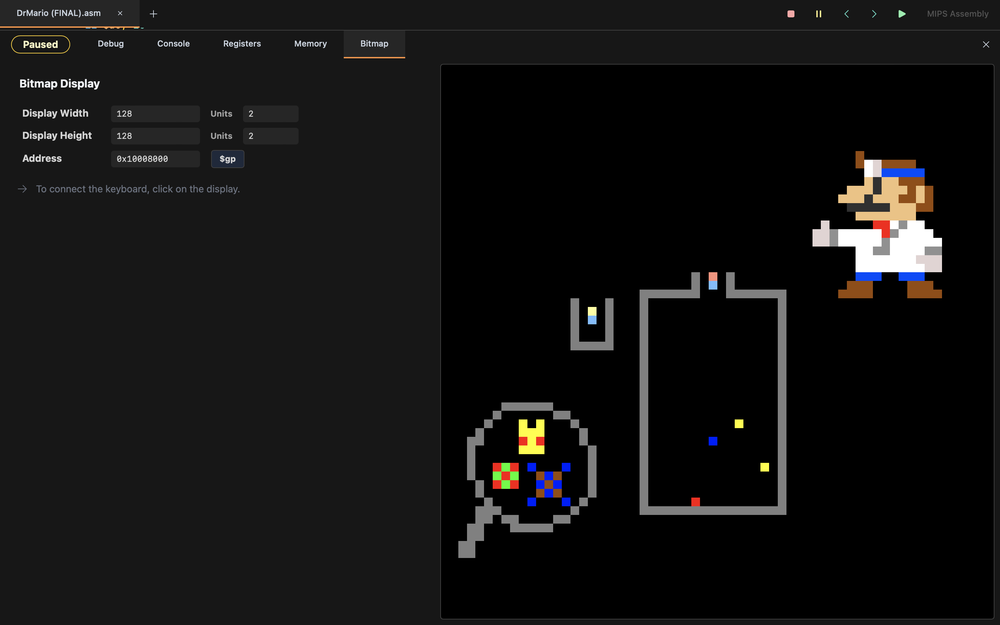
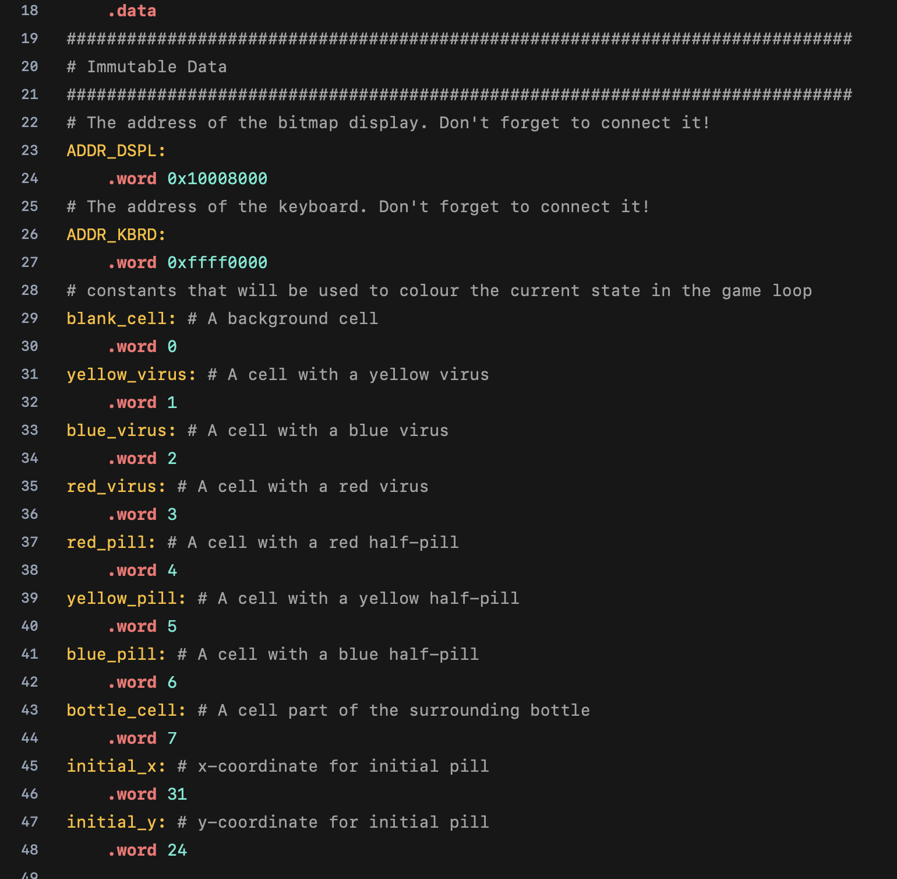
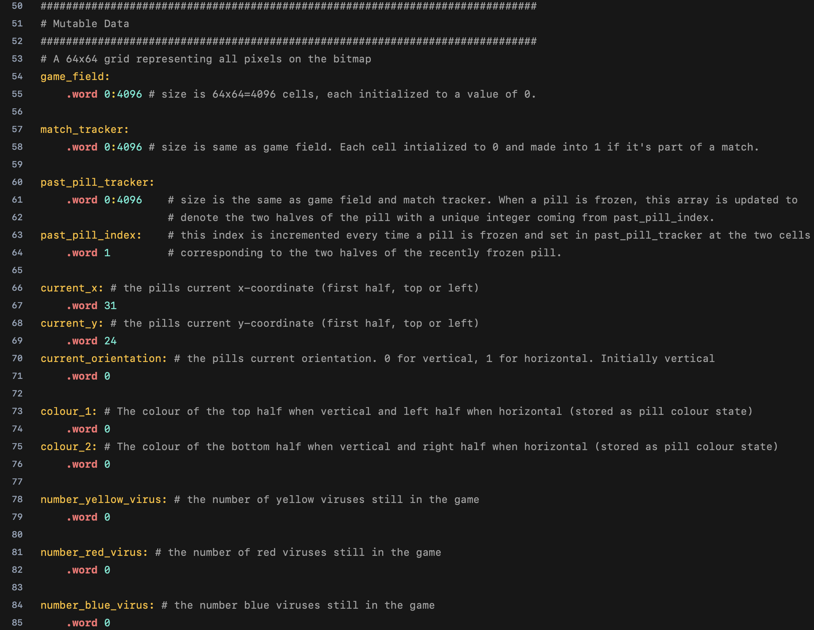
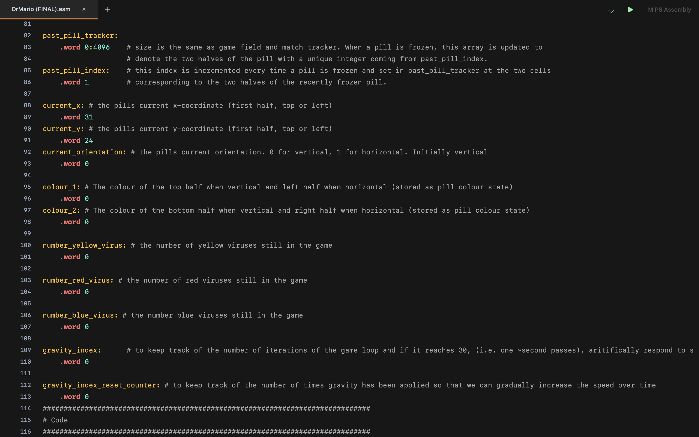

# Dr-Mario-in-MIPS-Assembly

## Project Summary
This Dr. Mario project represented both my first time working in assembly and my first time implementing a 
fully functional video game of any kind. It is based on the basic NES version of the game. While the graphics/visuals are of course not
as appealing as the actual game, the functionality is almost exactly the same. The game is designed to be run in
the [Saturn](https://github.com/1whatleytay/saturn) IDE/MIPS Assembler and as such, is completely written using MIPS Aseembly. The game can be run
directly within the included Bitmap Display for programs in Saturn.

### Gameplay Demo
[YouTube Demo](https://youtu.be/aSulnemWhpY?si=VUlJW8QEGbrhhQ--)

### Basic View

## Playing The Game
1. Download the `dr_mario.asm` file, and open it in Saturn.
2. Run the program and go to the Bitmap Display. Set the display width and display height to 128, and the unit width and height width to 2 pixels.
3. Rerun the program, open the Bitmap Display and click on the display to connect your keyboard. You can now move the capsules using `w,a,s,d`, and begin the game!

## Game Summary and Controls
- This game is a basic implementation of the classic arcade puzzle game, Dr. Mario.
- It is a tile-matching game. Medical capsules spawn at the top of the medicine bottle and can be controlled
by the player using `w, a, s, d`. Pressing `a` moves the capsule to the left, pressing `d` moves the capsule to
the right, pressing `w` rotates the capsule 90 degrees clockwise, and pressing `s` moves the capsule down
towards the bottom of the playing field, one line/row at a time time.
-  Each pill/capsule consists of two halves, where each half is either `red`, `blue`, or `yellow`. The colours for
the capsule halves are randomly generated. The playing field (inside the medicine bottle) is inhabited by
viruses. Each `virus` is also of a random colour from blue, yellow, or red. The virus do not move until they
are eliminated as part of a row or column of 4 or more capsules halves/viruses of the same colour.
- The player uses the `w,a,s,d` controls to manipulate the capsules and try to eliminate all the viruses as part
of a row or column, as mentioned above. When such a row/column is achieved, the capsule halves and
viruses are erased from the screen and any unsupported whole or half capsules will fall down until they
hit something that supports them. Any new alignments formed after this fall will also disappear.
- Once the player has eliminated all the viruses, they have won the game. If any part of the bottles opening
is blocked by a capsule, the game is over and the player has lost.

## Implementation Details
- Due to the low level nature of assembly and the associated difficulties in keeping track of MIPS assembly code, the
program is implemented using a strict function based approach. That is, all functionality and operations are achieved
through functions called by the game loop, which in turn call on each other. Once a function was implemented and
tested, this allowed me to know exactly what each call would achieve, as I worked on further features.
- To facilitate the manipulation of pixels/colours on the bitmap (i.e. accessing and writing to memory adresses repre-
senting specific pixels in the bitmap), a game field is stored in memory. This game field represents a 64x64 array (in
pixels, this is the size of the display) which holds the current state of the game. Using `Cell Getter` and `Cell Setter`
functions, I can use indices for the `x-coordinate` (0-63) and `y-coordinate` (also 0-63), which are then translated into
the corresponding memory address for that pixel. This allowed me to detach from worrying about constantly loading
and writing to specific memory addresses, and instead consider my functions and in memory data in terms of the
64x64 grid for the bitmap.

## Immutable Data Stored In Memory

## Mutable Data Stored In Memory

